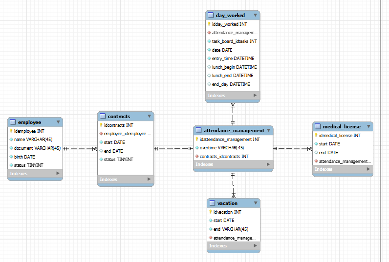

Projeto:

Registro de ponto de funcionários baseado no momento da requisição e consulta a banco de horas. Além disso, funções de administrador como inserção e atualização de dados de contratos de trabalho, funcionários, registro de férias e licenças médicas.

